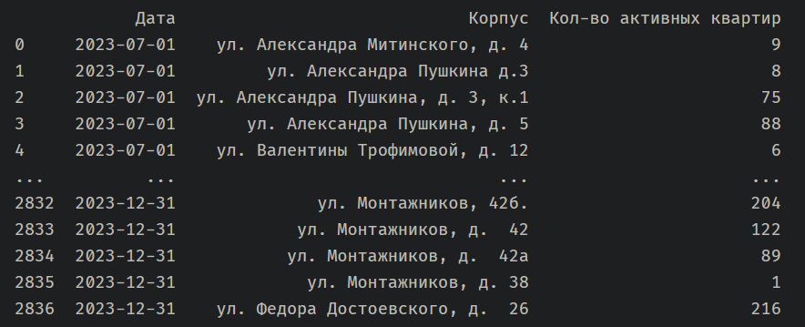
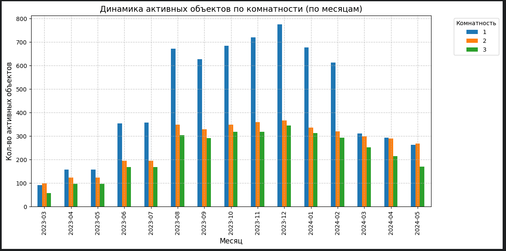
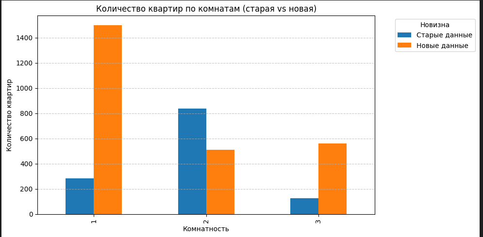
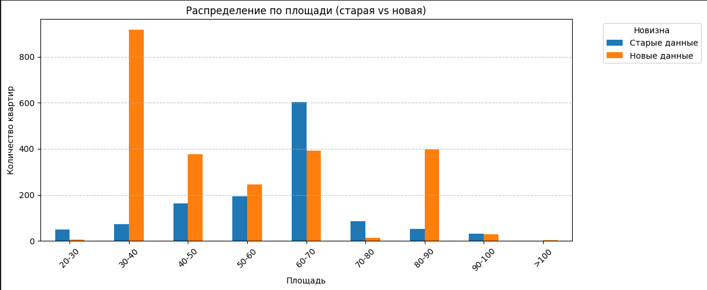
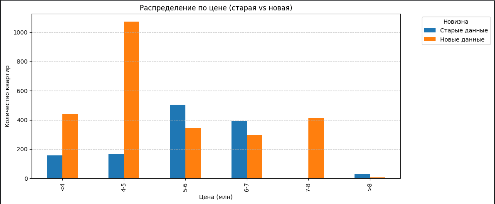

# test-task-Neolithic

## Зависимости
[](https://matplotlib.org/) [](https://pandas.pydata.org/) [](https://selectolax.readthedocs.io/) [](https://requests.readthedocs.io/) [](https://openpyxl.readthedocs.io/)


## Инструкия по запуску
pip
```sh
python -m venv .venv

.venv\Scripts\activate

python main.py
```

uv
```sh
uv sync
uv run main.py
```

Для работы как с `jupyter` в Zed
```sh
.venv\Scripts\activate
python -m ipykernel install --user --name .venv --display-name "Python (.venv)"

# для uv
uv run python -m ipykernel install --user --name .venv --display-name "Python (.venv)"
```

## Перове задание

### Сводная таблица с общим количеством активных объектов за каждый день рассматриваемого периода.


### График по месячному количеству активных объектов в разрезе комнатности.

Высокая активность наблюдается в осенне-зимний период, пик активности в декабре.
В период активности значительно повышается активность однокомнатных квартир в остальные периоды активность у квартир с одной, двумя и тремя комнатами примерно на одном уровне.


## Второе задание

### Сравнение как менялось количество представленных в экспозиции квартир по количеству комнат в новой выборке и в старой.



### Сравнение как менялась площадь по диапазонам <20, 20-30, 30-40 и тд. до >100 по количеству квартир в новой выборке и в старой.



### Сравнение как менялась цена по диапазонам <4млн, 4-5, 5-6 и тд. до >8 по количеству квартир в новой выборке и в старой.
